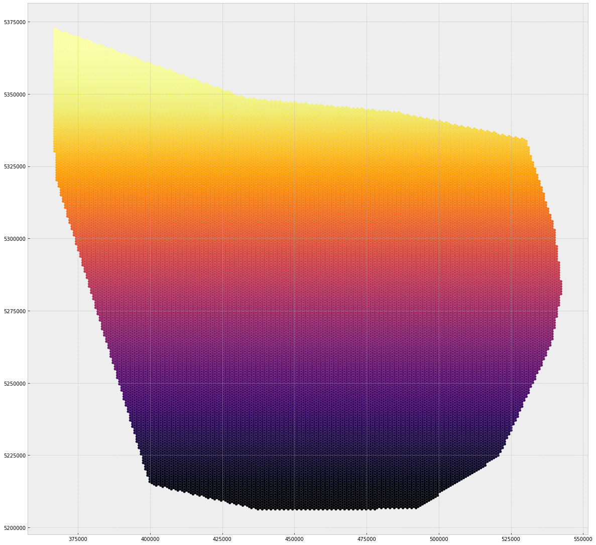

```python
# I will be using these packages over the course of the week
%matplotlib inline 
import os
import matplotlib.pyplot as plt
import seaborn as sns
plt.style.use('bmh')
from shapely.geometry import Point
import pandas as pd
import geopandas as gpd
import numpy as np
from geopandas import GeoSeries, GeoDataFrame;
from shapely.wkt import loads
```


```python
trails = gpd.read_file('pud_results_hex.shp')
os.getcwd()

```


    '/Users/markconrad/Documents/GeoHack Week/SocialMediaTrails/SocialMediaTrails/data'


```python
trails.plot(cmap='inferno', figsize =(20,20));
```





```python
#chloropleuth plot, results. log transformation. ML? 
# PCA, dimensionality reduction.
# Binary cross-entropy?


#np.log(trails)
trails.head()
```


<div>
<style>
    .dataframe thead tr:only-child th {
        text-align: right;
    }

    .dataframe thead th {
        text-align: left;
    }

    .dataframe tbody tr th {
        vertical-align: top;
    }
</style>
<table border="1" class="dataframe">
  <thead>
    <tr style="text-align: right;">
      <th></th>
      <th>FID</th>
      <th>PUD_YR_AVG</th>
      <th>PUD_JAN</th>
      <th>PUD_FEB</th>
      <th>PUD_MAR</th>
      <th>PUD_APR</th>
      <th>PUD_MAY</th>
      <th>PUD_JUN</th>
      <th>PUD_JUL</th>
      <th>PUD_AUG</th>
      <th>PUD_SEP</th>
      <th>PUD_OCT</th>
      <th>PUD_NOV</th>
      <th>PUD_DEC</th>
      <th>geometry</th>
    </tr>
  </thead>
  <tbody>
    <tr>
      <th>0</th>
      <td>0</td>
      <td>0.0</td>
      <td>0.0</td>
      <td>0.0</td>
      <td>0.0</td>
      <td>0.0</td>
      <td>0.0</td>
      <td>0.0</td>
      <td>0.0</td>
      <td>0.0</td>
      <td>0.0</td>
      <td>0.0</td>
      <td>0.0</td>
      <td>0.0</td>
      <td>POLYGON ((436865.7747709445 5206334.984202031,...</td>
    </tr>
    <tr>
      <th>1</th>
      <td>1</td>
      <td>0.0</td>
      <td>0.0</td>
      <td>0.0</td>
      <td>0.0</td>
      <td>0.0</td>
      <td>0.0</td>
      <td>0.0</td>
      <td>0.0</td>
      <td>0.0</td>
      <td>0.0</td>
      <td>0.0</td>
      <td>0.0</td>
      <td>0.0</td>
      <td>POLYGON ((438365.7747709445 5206334.984202031,...</td>
    </tr>
    <tr>
      <th>2</th>
      <td>2</td>
      <td>0.0</td>
      <td>0.0</td>
      <td>0.0</td>
      <td>0.0</td>
      <td>0.0</td>
      <td>0.0</td>
      <td>0.0</td>
      <td>0.0</td>
      <td>0.0</td>
      <td>0.0</td>
      <td>0.0</td>
      <td>0.0</td>
      <td>0.0</td>
      <td>POLYGON ((439865.7747709445 5206334.984202031,...</td>
    </tr>
    <tr>
      <th>3</th>
      <td>3</td>
      <td>0.0</td>
      <td>0.0</td>
      <td>0.0</td>
      <td>0.0</td>
      <td>0.0</td>
      <td>0.0</td>
      <td>0.0</td>
      <td>0.0</td>
      <td>0.0</td>
      <td>0.0</td>
      <td>0.0</td>
      <td>0.0</td>
      <td>0.0</td>
      <td>POLYGON ((441365.7747709445 5206334.984202031,...</td>
    </tr>
    <tr>
      <th>4</th>
      <td>4</td>
      <td>0.0</td>
      <td>0.0</td>
      <td>0.0</td>
      <td>0.0</td>
      <td>0.0</td>
      <td>0.0</td>
      <td>0.0</td>
      <td>0.0</td>
      <td>0.0</td>
      <td>0.0</td>
      <td>0.0</td>
      <td>0.0</td>
      <td>0.0</td>
      <td>POLYGON ((442865.7747709445 5206334.984202031,...</td>
    </tr>
  </tbody>
</table>
</div>


